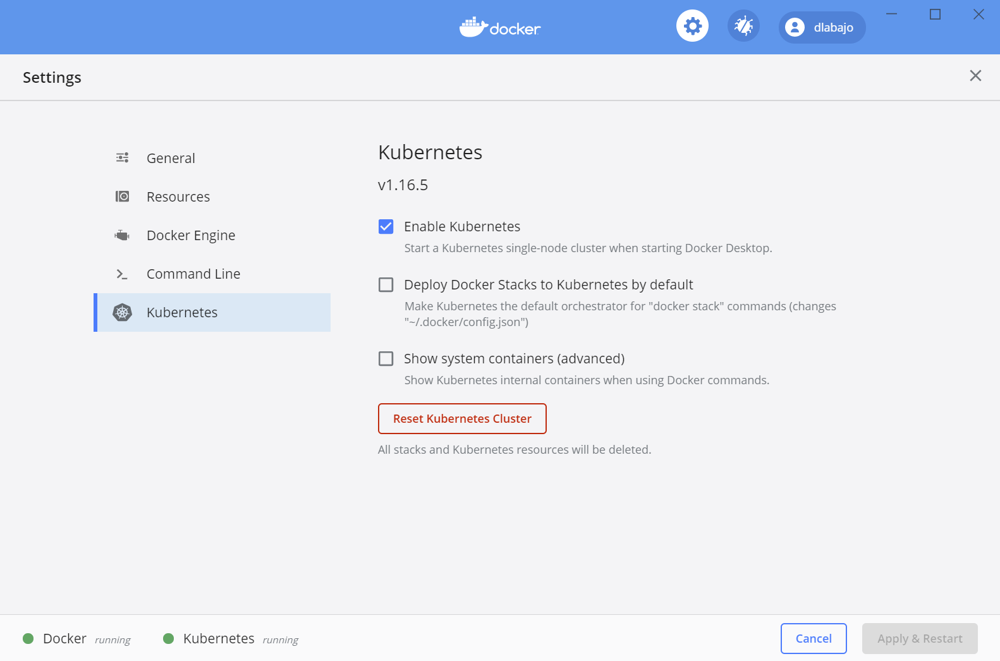
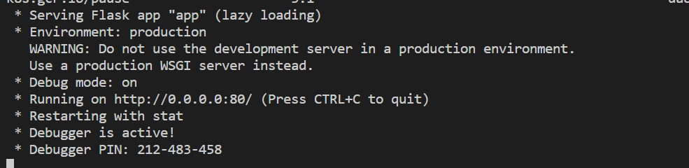
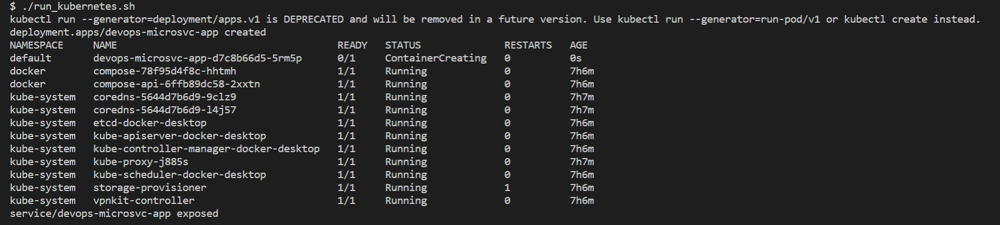

[](https://circleci.com/gh/dennislabajo/DevOps_Microservices)


# Operationalizing A Machine Learning Model


### Introduction

This project is a simple demonstration of how a pre-trained machine learning model can be operationlized as a micro-service hosted in an open-source, production-grade container orchestration platform, Kubernetes.  The machine learning model was developed in Python using `sklearn` libraries and was pre-trained on a classic and well-known dataset, Boston Housing which can be found in [Kaggle](https://www.kaggle.com/c/boston-housing).  The dataset contains a number of variables such as crime rate, land zone, property tax, average number of rooms per dwelling, etc. and the model makes a prediction on house price based on input data from an API call.

The artifacts in this repository contains the Python source code and configuration files that containerizes the machine learning model, publish the image to the Docker repository, as well as deploy an instance of this image to a running cluster in Kubernetes.  A simple CI/CD configuration is included in this project that performs linting on the Python code and Dockerfile for every push to the repository.

<br>

### Requirements

The application and deployment process was tested on a local Windows environment with Docker and Kubernetes installed.  Docker for Windows already include Kubernetes that can easily be activated from the Docker console.



<br>

Git Bash is required for running the shell scripts on Windows platform.  While a Windows Subsystem for Linux is available for running a local Linux environment eg. Ubuntu, WSL unfortunately is a contained environment that has no access to Docker/Kubernetes in Windows.  This may change with WSL2 which at this time of writing has not been generally made available.

A docker account is also required for publishing the Docker image to the repository.  This can be done by signing up for a free account in docker.com.

<br>

### Core Artifacts

`1`.  **.circleci/config.yml** - CI/CD yaml file for creating a runtime environment with the application dependencies and then performs a linti on the Dockerfile and the python application source code.

`2.`  **Makefile** - contain steps for installing dependencies via pip command and another step for lint.

`3.`  **model_data/boston_housing_prediction.joblib** - A serialized and pre-trained machine learning model.  The model is loaded once the Python application starts up in a Docker container.

`4.`  **model_data/housing.csv** - Training data for which the machine learning was trained on.

`5.`  **Dockerfile** - Configuration file for building the application's container.  Includes the base image and instructions for copying the application files over to the container.  Also installs libraries and packages the application depends on.  Exposes an HTTP port of 80 and the command to run when the Docker container starts.

`6.`  **requirements.txt** - List of python libraries with specific version numbers the machine learning model depends on.

`7.`  **run_docker.sh**`** - Shell script for building the Docker image, displaying list of images, and then runs the container.

`8.`  **upload_docker.sh** - Shell script for tagging the docker image, authenticating to the docker.com website, and then pushing the image to the repository.

`9.`  **run_kubernetes.sh** - Shell script for running the docker container into Kubernetes; exposes a service that provides access to the containerized application.

`10.` **make_prediction.sh** - Shell script for testing the application.  Performs a `curl` command for sending a POST http request with a JSON-format payload.

### Steps

Ensure all environment requirements are met before running the steps below. 

`1.`  Open Git Bash and clone this repository

`2.`  Once cloned, `CD` to the root folder and run the shell script `run_docker.sh`.  The result should show a list of docker images and then starts up the containerized application.  Status should show the following:



<br>

`3.`  Test the application by running the shell script `make_prediction.sh` from a separate instance of Git Bash.  The result should return a JSON-format house price prediction.

`4.`  Run the shell script `upload_docker.sh` to tag the Docker image and upload image to the Docker repository.  Depending on your network bandwidth, this step may take some time to complete.

`5.`  Exit out / close the container that was spawned in step 2 by pressing `CTRL-C` or running  `docker container stop <container id>`

`6.`  Run the shell script `run_kubernetes.sh` to deploy the container application in Kubernetes.



<br>

`7.`  Run `make_predictions.sh` again to test the application but this time running in Kubernetes.

<br>

> &nbsp;
> **NOTE:**  Clean-up once you are done testing the application.  To do so, run the following commands:
>```
> kubectl delete svc devops-microsvc-app
> kubectl delete deployment devops-microsvc-app
>```

